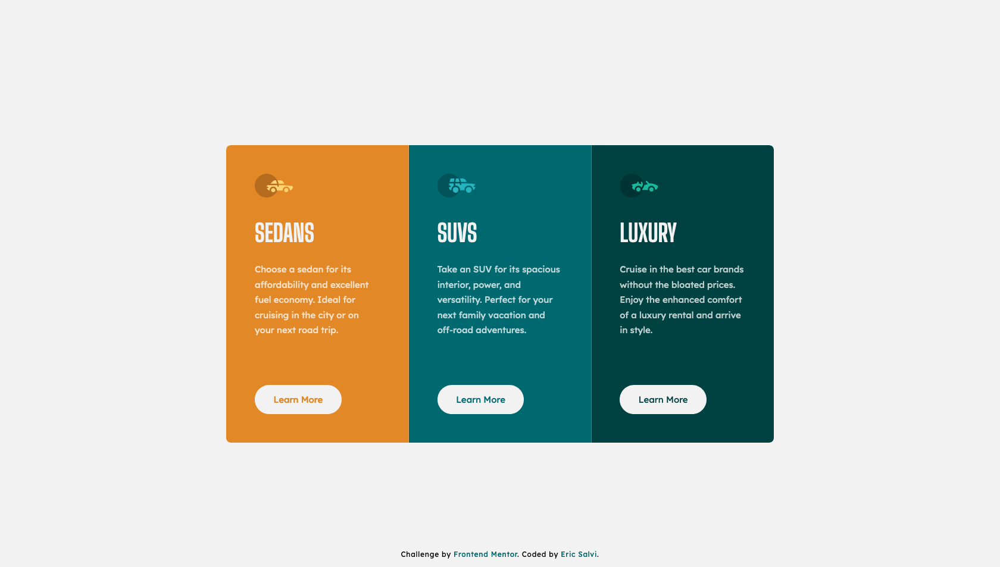

# Frontend Mentor - 3-column preview card component solution

This is a solution to the [3-column preview card component challenge on Frontend Mentor](https://www.frontendmentor.io/challenges/3column-preview-card-component-pH92eAR2-). Frontend Mentor challenges help you improve your coding skills by building realistic projects. 

## Table of contents

- [Overview](#overview)
  - [The challenge](#the-challenge)
  - [Screenshot](#screenshot)
  - [Links](#links)
- [My process](#my-process)
  - [Built with](#built-with)
  - [What I learned](#what-i-learned)
  - [Continued development](#continued-development)
- [Author](#author)

## Overview

### The challenge

Users should be able to:

- View the optimal layout depending on their device's screen size
- See hover states for interactive elements

### Screenshot

### Links

- Solution URL: [frontendmentor.io](https://www.frontendmentor.io/solutions/3column-preview-card-htmlcss-using-rem-units-flexbox-and-variables-CMoDUd7Ad)
- Live Site URL: [https://ericsalvi.github.io/3-column-preview-card-component/](https://ericsalvi.github.io/3-column-preview-card-component/)

## My process

### Built with

- Semantic HTML5 markup
- CSS custom properties
- Flexbox
- CSS variables for colors
- Mobile-first workflow
- Visual Studio Code
- https://autoprefixer.github.io/
- axe DevTools for accessibility

### What I learned

I solidified my mobile-first approach. Praticed using flexbox and rem units. Introduced CSS variables for colors.

### Continued development

I want to keep on using CSS variables from here on out. That way when I get into more of the advanced challenges, this will come in hand for quickly adjusting light or dark mode functionality on the challenge content. 

## Author

- Website - [Eric Salvi](https://github.com/ericsalvi)
- Frontend Mentor - [@ericsalvi](https://www.frontendmentor.io/profile/ericsalvi)